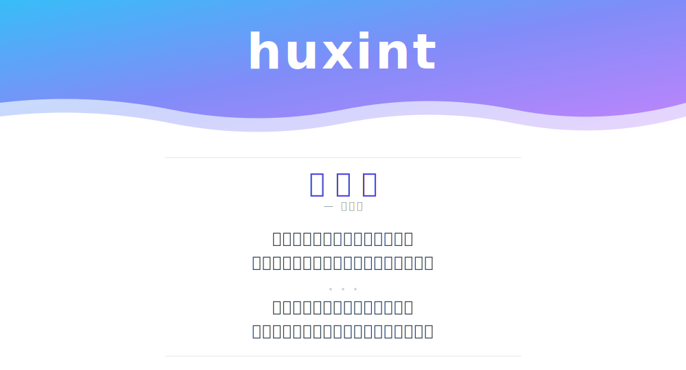

### Stack

  

---

### Stats

  <picture>
    <source media="(prefers-color-scheme: dark)" srcset="https://github-readme-stats.vercel.app/api?username=huxint&theme=tokyonight&hide_border=true&show_icons=true&include_all_commits=true&count_private=true&cache_seconds=14400">
    
  </picture>
  <picture>
    <source media="(prefers-color-scheme: dark)" srcset="https://github-readme-stats.vercel.app/api/top-langs/?username=huxint&theme=tokyonight&hide_border=true&layout=compact&langs_count=8&cache_seconds=14400">
    
  </picture>

  <picture>
    <source media="(prefers-color-scheme: dark)" srcset="https://github-readme-activity-graph.vercel.app/graph?username=huxint&theme=tokyo-night&bg_color=00000000&hide_border=true&area=true&color=8B5CF6&line=8B5CF6&point=6366F1">
    
  </picture>

